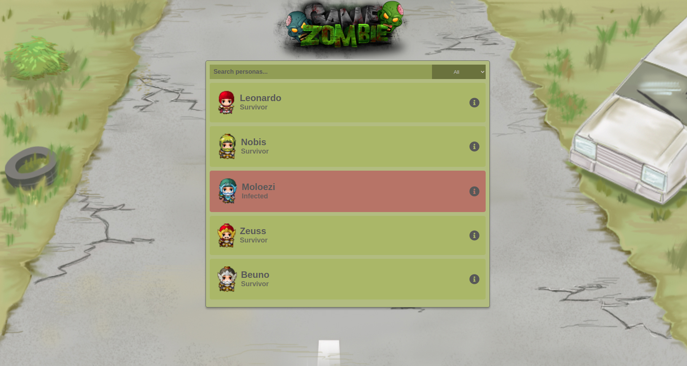

## Zombie Game

[Figma layout](https://www.figma.com/file/T9ESMRd4N2UrRX5pL07xzo/Zombie-game?node-id=0%3A1)

<hr />
#### Description
This project is a list of survivors of the apocalypse, where we can save or infect the people on that list.

<hr />
#### Stack
- Typescript
- Next.js
- Jest & testing-library/React
- Styled-components
- Redux

<hr />
#### Install packages

```
yarn
```

or 

```
npm install
```

#### Run project

```
yarn dev
```

or 

```
npm run dev
```

#### Test project

```
yarn test
```

or 

```
npm run test
```